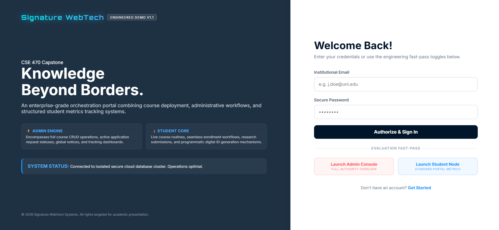
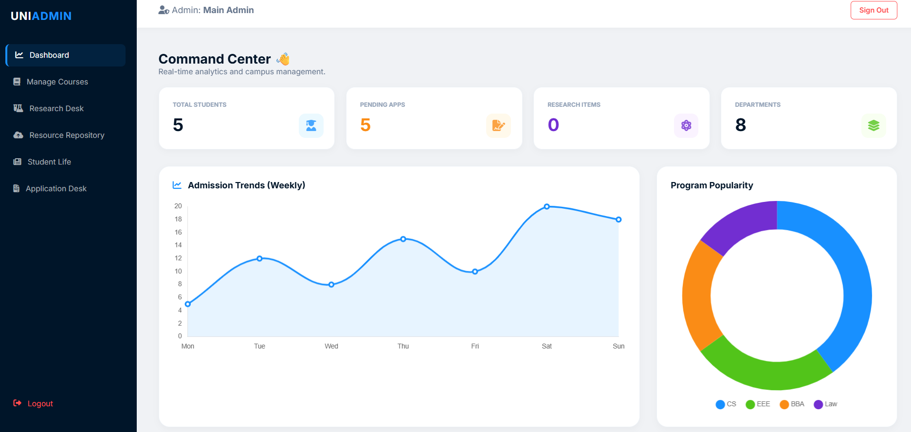
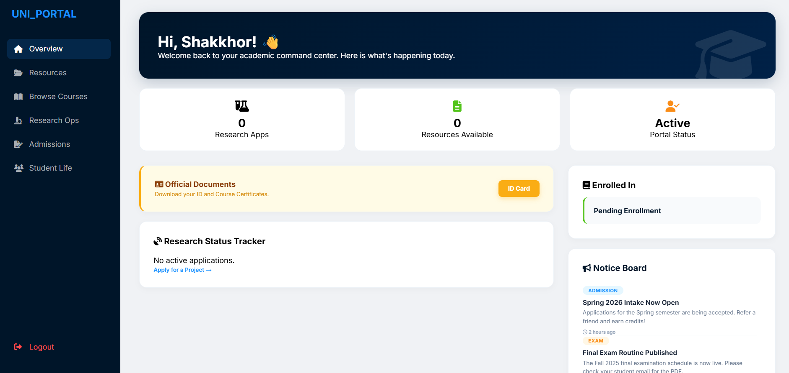
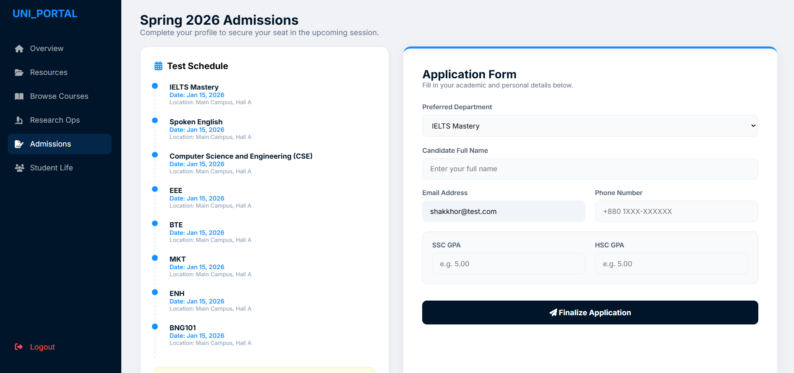
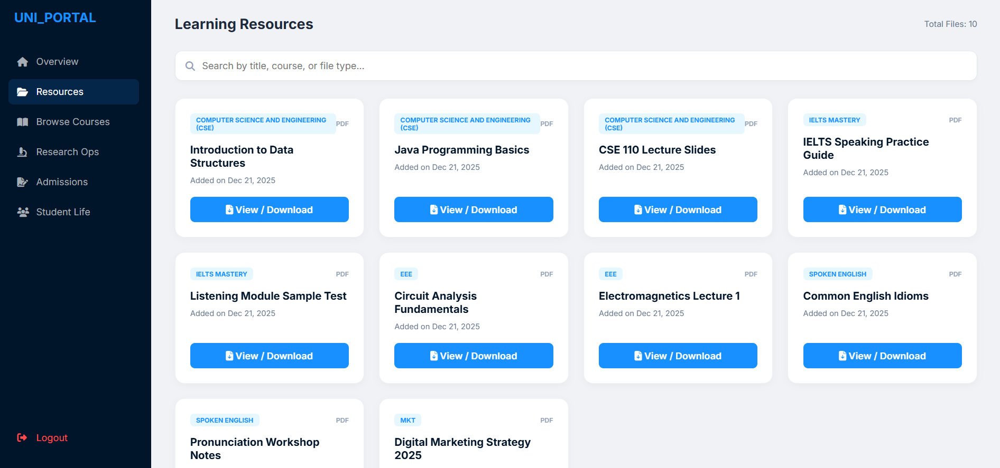
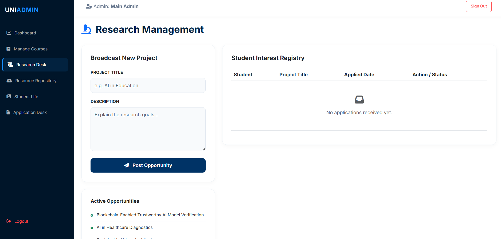
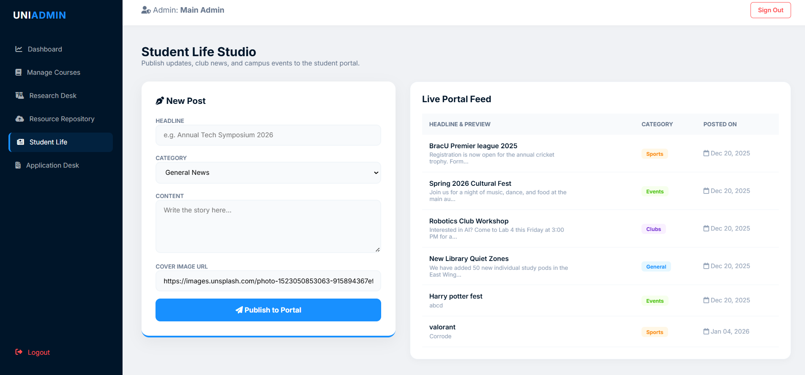

# 🏛️ University Student Excellence & Academic Portal

A comprehensive, full-stack Academic & Institutional Management System built using **Laravel (PHP)** and **MySQL**. This application features robust role-based workflows designed to streamline operations for university administrators while providing students with a fully interactive cockpit for curriculum enrollment, automated document generation, and tracking research opportunities.

---

## 📸 System Interface Showcase

### 🔑 Authentication Gate & Fast-Pass Switcher
Implements secure, state-managed user sessions with custom redirect routing based on database roles.

### 📊 Admin Command Center
The main administrative dashboard showing real-time student trends, pending intakes, and faculty distributions.

### 🎓 Student Cockpit Overview
The core workspace for students to track their portal status, official documents, and institutional announcements.

### 📝 Admissions & Enrollment Form
Interactive registration engine where student candidates apply for upcoming university terms.

### 📚 Learning Resources Hub
The repository where users search, stream, and download course slide decks and academic material.

### 🔬 Research Desk Management
Administrative panel for broadcasting research projects and managing incoming student applications.

### 📰 Student Life Studio
The campus social feed center for publishing announcements, event highlights, and club updates.

---

## 🛠️ System Core Features

### 🔐 1. Multi-Role Authentication Gates
- Implements secure, state-managed user sessions with custom redirect routing depending on database role definitions (`admin` vs `student`).
- Enforces strict route-group isolation through standard web auth middleware components.

### 💼 2. Administrative Control Desk
- **Curriculum & Department CRUD:** Built-in form architectures for managing academic faculties seamlessly validated through backend sanitization channels.
- **Intake Processing Queue:** Single-action triggers allowing administrators to fast-track or reject student enrollment profiles via multi-table database aggregates.
- **Resource Repository:** High-performance upload gateway supporting materials and physical assets up to **10MB** with immediate storage-disk partitioning.

### 🎓 3. Comprehensive Student Cockpit
- **Voluntary Enrollment Engine:** Interactive dashboard where students can pick up a specific degree curriculum with one click or voluntarily execute a withdrawal sequence without risking relational schema breakages.
- **Keyword-Matched Class Routines:** Low-overhead string-matching parsing routines (`cse`, `eee`, `ielts`) to output customized weekly grid schedules relative to a user's chosen major.
- **Automated Digital Credentials (DomPDF Engine):**
  - **Dynamic ID Badge Compiler:** Captures real-time metadata and renders a secure badge container. To conserve physical disk storage, incoming photo inputs are compiled directly into raw **Base64 Data URIs** inside the view.
  - **Landscape Graduation Validator:** Validates student records to stream high-resolution, landscape A4 certification receipts on-the-fly.

---

## 🏗️ Technical Architecture & Schema Map

The platform leverages an optimized MVC (Model-View-Controller) topology to maintain high code isolation and performant data delivery:

- **Database Layer (MySQL):** Structured utilizing explicit foreign key constraints tracking users, departments (`courses`), applications, and resources. Includes default tracking layers such as session monitors and automated system cache structures.
- **Data Models:** Driven by Eloquent Relationships (e.g., `User belongsTo Course`, `Application belongsTo Course`) utilizing strict `$fillable` array properties to completely negate Mass Assignment vulnerabilities.
- **Controller Matrix:** Modularized logic split across dedicated services (`CertificateController`, `RoutineController`, `ResearchController`, `StudentLifeController`) ensuring low execution footprints and standard RESTful endpoint routing.